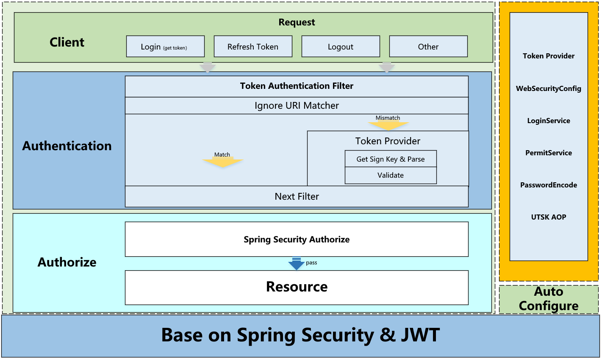
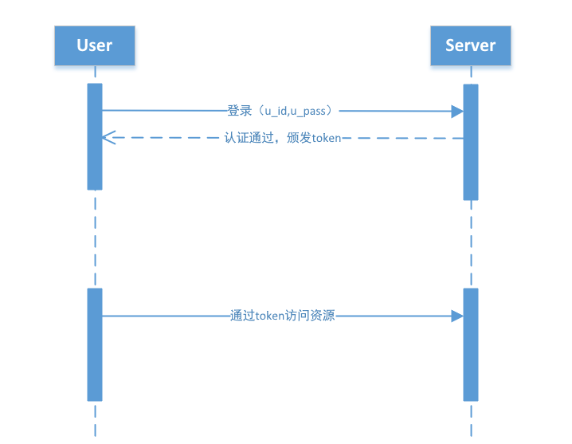
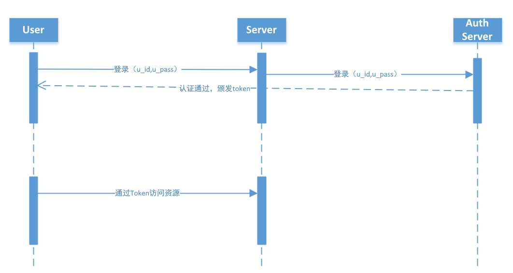

[](http://www.apache.org/licenses/LICENSE-2.0)

# Akagi

> **Akagi**让你的SpringBoot应用快速集成认证授权


:mask:疫情无情，人有情，**Star**:star:一下吧 :point_up:


## 简介

>​		Akagi 是一个轻量封装的:lock:认证鉴权框架，基于Spring Security + JWT 实现的SpringBoot Starter。
>
>接入简单快速且无侵入。Akagi就像球场上的赤木刚宪，守护禁区的安全:hand:。


## 设计



## 接入模式说明

### SINGLE模式



### CS模式



## Quick Start

* git clone & mvn install 

* Add dependency

  ```java
      <dependency>
        <groupId>org.siu</groupId>
        <artifactId>akagi</artifactId>
        <version>${version}</version>
      </dependency>
  ```

- SINGLE 模式接入

  - 配置

    ```yml
    akagi:
      security:
        # 开放无需认证的接口
        permit-all:
          - "/v1/api/login"
    # redis 配置
    spring:
      redis:
        host: redis.host
        port: 6379
        timeout: 20000
        lettuce:
          pool:
            max-active: 200
            max-wait: -1
            max-idle: 10
            min-idle: 0
    ```

  - 代码示例

    ```java
    /**
     * @Author Siu
     */
    @SpringBootApplication
    public class Application {
    
        public static void main(String[] args) {
            SpringApplication.run(Application.class, args);
        }
    
    
        @Data
        public static class Login {
            private String username;
            private String password;
        }
    
        @Slf4j
        @RestController
        @RequestMapping("/v1/api")
        public static class AuthController {
    
            @Resource
            private LoginService loginService;
    
            /**
             * 登录接口
             *
             * @param login
             * @return
             */
            @PostMapping("/login")
            public Object login(@Validated @RequestBody Login login) {
                return loginService.login(login.getUsername(), login.getPassword(), false);
            }
    
            @GetMapping("/logout")
            public Object logout() {
                loginService.logout();
                return "success";
            }
    
            @Logout
            @GetMapping("/logout1")
            public Object logout1() {
                return "success";
            }
    
            @Black
            @GetMapping("/black")
            public Object black() {
                return "success";
            }
    
    
            /**
             * 刷新token接口（接口使用权限控制）
             *
             * @return
             */
            @GetMapping("/refresh_token")
            //@PreAuthorize("@pms.hasPremit('dafasdfsdfa')")
            //@PreAuthorize("hasRole('ADMIN') AND hasRole('DBA')")
            @PreAuthorize("hasAuthority('TEST1') AND hasAuthority('TEST2')")
            public Object refreshToken() {
                return loginService.refreshToken();
    
            }
    
    
        }
    
    
        /**
         * 实现认证授权相关的业务
         * 1、用户基本信息 2、权限列表
         */
        @Service
        public static class AuthService extends AbstractAuthService {
    
            @Resource
            PasswordEncoder passwordEncoder;
    
            @Override
            public Auth userDetails(String s) {
                Auth userDetails = new Auth();
                /**
                 * 以下模拟从数据库查询用户密码
                 *
                 * 可以根据业务情况实现具体的逻辑
                 * 如：判断用户是否进入黑名单/未激活等
                 */
    
                LoginUser user = new LoginUser();
                user.setId("siu");
                user.setPass(passwordEncoder.encode("12345"));
    
                List<Authorities> authoritiesList = new ArrayList<>();
                Authorities authorities = new Authorities();
                authorities.setRole("USER");
                authorities.setPermit("USER:UPDATE");
                authoritiesList.add(authorities);
    
    
                Authorities authorities1 = new Authorities();
                authorities1.setRole("TEST1");
                authorities1.setPermit("TEST2");
                authoritiesList.add(authorities1);
    
                userDetails.setUser(user);
                userDetails.setAuthorities(authoritiesList);
    
                return userDetails;
            }
        }
    
    
    }
    
    ```

- CS模式接入

  - SERVER（同SINGLE模式）

  - CLIENT

    - 配置
  
      ```yml
      akagi:
        security:
          # 开放无需认证的接口
            permit-all:
            - "/v1/client/api/login"
          mode: CS_CLIENT
      ```
  
      
  
    - 代码示例
  
      ```java
      @SpringBootApplication
      public class Application {
      
          public static void main(String[] args) {
              SpringApplication.run(Application.class, args);
          }
      
      
          @Slf4j
          @RestController
          @RequestMapping("/v1/client/api")
          public static class AuthController {
      
      
      
              /**
               * 登录接口
               *
               * @return
               */
              @PostMapping("/login")
              public String login() {
                  // 请求服务端（CS_SERVER）获取token
                  return "token";
              }
      
      
              /**
               * 接口使用权限控制
               *
               * @return
               */
              @PostMapping("/test")
              @PreAuthorize("@pms.hasPermit('USER')")
              public Object test() {
                  return "success";
      
              }
          }
      }
      ```
  
      
  

## 配置说明

```json
{
  "groups": [
    {
      "name": "akagi.security",
      "type": "org.siu.akagi.autoconfigure.AkagiProperties",
      "sourceType": "org.siu.akagi.autoconfigure.AkagiProperties"
    }
  ],
  "properties": [
    {
      "name": "akagi.security.json-web-token-base64-secret",
      "type": "java.lang.String",
      "description": "token base64 secret",
      "sourceType": "org.siu.akagi.autoconfigure.AkagiProperties",
      "defaultValue": "ZmQ0ZGI5NjQ0MDQwY2I4MjMxY2Y3ZmI3MjdhN2ZmMjNhODViOTg1ZGE0NTBjMGM4NDA5NzYxMjdjOWMwYWRmZTBlZjlhNGY3ZTg4Y2U3YTE1ODVkZDU5Y2Y3OGYwZWE1NzUzNWQ2YjFjZDc0NGMxZWU2MmQ3MjY1NzJmNTE0MzI="
    },
    {
      "name": "akagi.security.json-web-token-expire",
      "type": "java.lang.Long",
      "description": "默认token失效时间(秒)",
      "sourceType": "org.siu.akagi.autoconfigure.AkagiProperties",
      "defaultValue": 86400
    },
    {
      "name": "akagi.security.json-web-token-expire-for-remember",
      "type": "java.lang.Long",
      "description": "记住密码时token失效时间(秒)",
      "sourceType": "org.siu.akagi.autoconfigure.AkagiProperties",
      "defaultValue": 108000
    },
    {
      "name": "akagi.security.json-web-token-refresh-permit",
      "type": "java.lang.String",
      "description": "刷新token权限标识，默认：\"SYS:REFRESH_TOKEN\"",
      "sourceType": "org.siu.akagi.autoconfigure.AkagiProperties"
    },
    {
      "name": "akagi.security.mode",
      "type": "org.siu.akagi.autoconfigure.AkagiMode",
      "description": "模式 默认：单体应用接入模式 1、单体应用模式，集成授权认证、资源权限校验 2、CS模式，服务端提供认证和授权，客服端接收token（用户信息\/认证授权信息）进行资源权限校验",
      "sourceType": "org.siu.akagi.autoconfigure.AkagiProperties"
    },
    {
      "name": "akagi.security.password-encoder",
      "type": "java.lang.Class<? extends org.springframework.security.crypto.password.PasswordEncoder>",
      "description": "密码加密器，默认使用 BCryptPasswordEncoder",
      "sourceType": "org.siu.akagi.autoconfigure.AkagiProperties"
    },
    {
      "name": "akagi.security.permit-all",
      "type": "java.util.Set<java.lang.String>",
      "description": "开放无需认证的接口:支持 Ant Matcher",
      "sourceType": "org.siu.akagi.autoconfigure.AkagiProperties"
    },
    {
      "name": "akagi.security.permit-checker",
      "type": "java.lang.Class<? extends org.siu.akagi.authorize.Authorize>",
      "description": "权限校验，默认使用 PermitService",
      "sourceType": "org.siu.akagi.autoconfigure.AkagiProperties"
    },
    {
      "name": "akagi.security.super-user",
      "type": "java.lang.String",
      "description": "超级用户",
      "sourceType": "org.siu.akagi.autoconfigure.AkagiProperties"
    },
    {
      "name": "akagi.security.token-sign-key-mode",
      "type": "org.siu.akagi.autoconfigure.AkagiTokenSignKeyMode",
      "description": "Token Sign Key 模式 PUBLIC : 所有用户公用一个 Token Sign CUSTOM : 每个用户单独的 Token Sign",
      "sourceType": "org.siu.akagi.autoconfigure.AkagiProperties"
    }
  ],
  "hints": []
}
```


## TODO

1. 测试


## Feedback

 [gshiwen@gmail.com](mailto:gshiwen@gmail.com)

## License

[Apache License 2.0](LICENSE)


